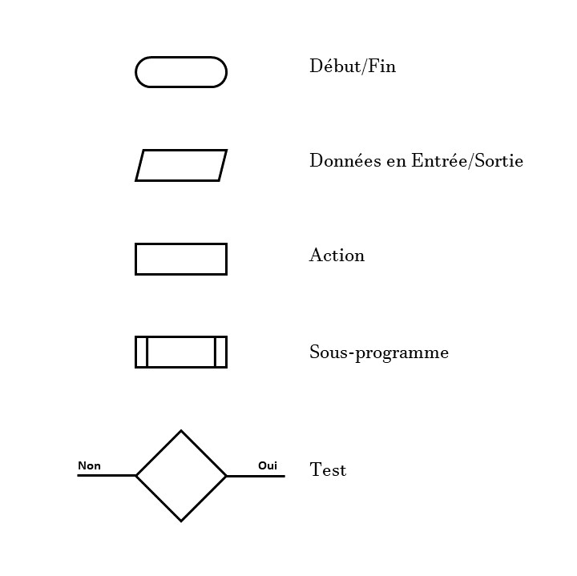
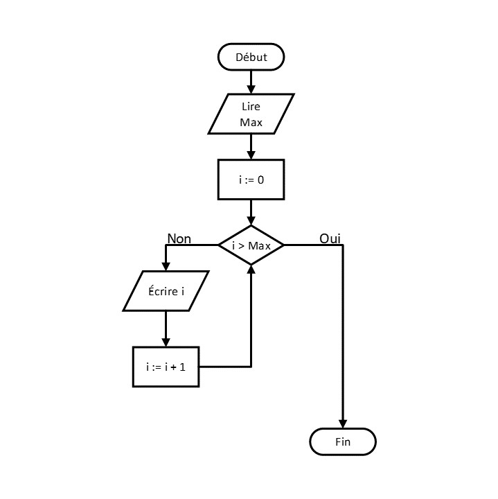

# 📚 **L'Algorithme**

### 📓 [Définition](https://www.larousse.fr/dictionnaires/francais/algorithme/2238)

Ensemble de **règles opératoires** dont l'application permet de résoudre un problème énoncé au moyen d'un **nombre fini d'opérations**. Un algorithme peut être traduit, grâce à un langage de programmation, en un programme exécutable par un ordinateur.

### 📓 [Les façons de décrire un Algorithme](https://en.wikipedia.org/wiki/Algorithm#Algorithm_example)

1. **Description de haut-niveau** : La prose utilisée pour décrire l'algorithme est celui du langage naturel.
2. **Description formelle** : Les **pseudo-codes**, les **diagrammes de flux** ou **algorigramme**, et les **programmes sources** sont des façons structurées d'exprimer un algorithme afin d’éviter les ambiguïtés du langage naturel.

### 📓 [Les Algorigrammes](https://fr.wikipedia.org/wiki/Organigramme_de_programmation)

Un algorigramme est un diagramme de flux qui représente l'enchaînement des opérations et des décisions effectuées par un programme.

|<br><sup>Les symboles normalisés d'un algorigramme</sup>|<br><sup>Un exemple d'algorigramme</sup>|
| :--- | ---: |

### 📓 [Les Pseudo-codes](https://fr.wikipedia.org/wiki/Pseudo-code)

Le pseudo-code est une façon de décrire un algorithme en langage presque naturel, sans référence à un langage de programmation en particulier.

Étant donné que la prose du pseudo-code se rapproche du programmes source en Javascript, nous y reviendront plus en détails plus tard. Pour plus de details sur les pseudo-codes, visiter le lien suivant ; [Pseudo-code](https://info.blaisepascal.fr/pseudo-code).
<br>
<br>


## ✅ Activité 5

|Écrire un algorithme qui effectue une [permutation](https://fr.wikipedia.org/wiki/Permutation_(informatique)) de valeurs entre deux variables.|
|:--|

```
Algorithme Permuter 2 variables
Entrée : Deux variables VariableA et VariableB ayant des valeurs distinctes.
         VariableA ← 'A'
         VariableB ← 'B'
Sortie : La VariableB a la valeur de départ de la VariableA, et vice-versa.
         VariableA ← 'B'
         VariableB ← 'A'
Début
    1. VariableTemp ← VariableA
    2. VariableA ← VariableB
    3. VariableB ← VariableTemp
Fin
```
En (1), créer une variable temporaire VariableTemp et l'initialiser avec la valeur de VariableA.<br>
En (2), copier la valeur de la VariableB dans la VariableA. Ce qui détruit automatiquement la valeur initiale de VariableA et la remplace par la valeur de VariableB.<br>
En (3), copier la valeur de la variable temporaire VariableTemp dans la VariableB.

|Réécrire l'algorithme de Permutation informatique en JavaScript.|
|:--|

Créer un fichier et le nommer `permutation.js`
```javascript
let VariableA = 'A';
let VariableB = 'B';

// Créer une variable temporaire VariableTemp et l'initialiser avec la valeur de VariableA.
const VariableTemp = VariableA
// Copier la valeur de la VariableB dans la VariableA.
VariableA = VariableB
// Copier la valeur de la variable temporaire VariableTemp dans la VariableB.
VariableB = VariableTemp

// Retourner les valeurs de VariableA et de VariableB dans cet ordre.
console.log(VariableA)
console.log(VariableB)
```
