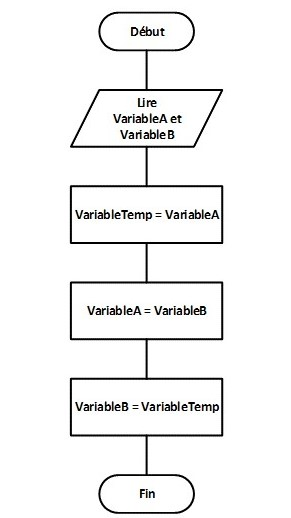

## ✅ Activité 5

|Écrire un algorithme qui effectue une [permutation](https://fr.wikipedia.org/wiki/Permutation_(informatique)) de valeurs entre deux variables.|
|:--|

||
| :--- |

###### <u>Une description de haut niveau</u> :
Pour permuter les valeurs distinctes de deux variables VariableA et VariableB, il suffit de suivre ces étapes :
1. Créer une variable temporaire VariableTemp et l'initialiser avec la valeur de VariableA ;
2. Copier la valeur de la VariableB dans la VariableA. Ce qui détruit automatiquement la valeur initiale de VariableA et la remplace par la valeur de VariableB ;
3. Copier la valeur de la variable temporaire VariableTemp dans la VariableB.
###### <u>Un Algorigramme</u> :
||
| :--- |
###### <u>Un pseudo-code</u> :
Le problème a été simplifié à des valeurs spécifiques pour faciliter la compréhension.
```
Algorithme - Permuter 2 variables
Entrée : Deux variables VariableA et VariableB ayant des valeurs distinctes.
         VariableA ← 'A'
         VariableB ← 'B'
Sortie : La VariableB a la valeur de départ de la VariableA, et vice-versa.
         VariableA ← 'B'
         VariableB ← 'A'
Début
    1. VariableTemp ← VariableA
    2. VariableA ← VariableB
    3. VariableB ← VariableTemp
Fin
```
###### <u>Un programme source Javascript</u> :
- [x] Créer un fichier et le nommer `permutation.js` et y écrire :
```javascript
// Déclarer et initialiser les variables avec des valeurs différentes.
let VariableA = 'A';
let VariableB = 'B';

// Début Algorithme.
// 1. Créer une variable temporaire VariableTemp et l'initialiser avec la valeur de VariableA.
const VariableTemp = VariableA;
// 2. Copier la valeur de la VariableB dans la VariableA.
VariableA = VariableB;
// 3. Copier la valeur de la variable temporaire VariableTemp dans la VariableB.
VariableB = VariableTemp;
// Fin Algorithme.

// Code ajouter pour permettre de visualiser la solution.
// Retourner les valeurs de VariableA et de VariableB dans cet ordre.
console.log(VariableA, VariableB);
```
- [x] Exécuter le script en utilisant [JS Bin](https://jsbin.com/sucipow/3/edit?js,console). 
